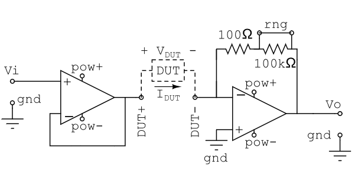
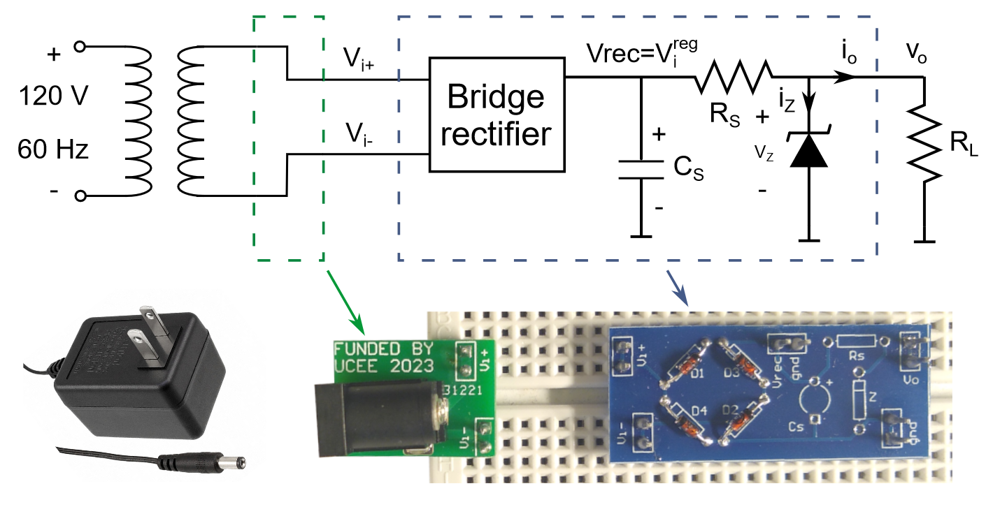
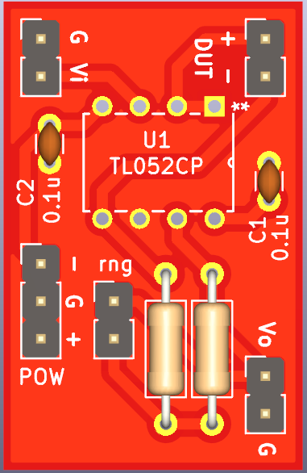
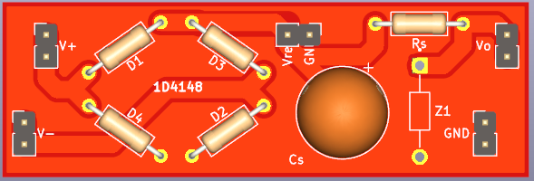

# ENEL-361 Lab PCBs
This repo holds a few KiCAD PCB projects for circuits in ENEL-361 labs. All boards fit a 2.54mm pitch breadboard.

  
   

## NTC Curve Tracer PCB
Used for tracing the impedance of an NTC thermistor with optional gain jumper.

  

## Rectifier Regulator PCB
Full bridge rectifier and Zener based voltage regulator with RC circuit for smoothing output.

  

## Barrel Jack PCB
Barrel jack breakout board to easily mount a barrel jack on a breadboard.

  

